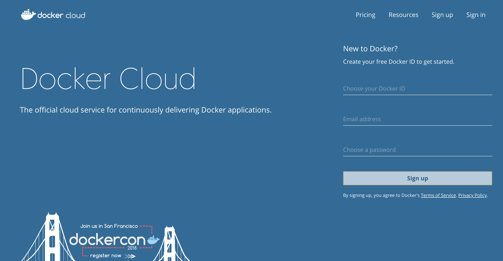
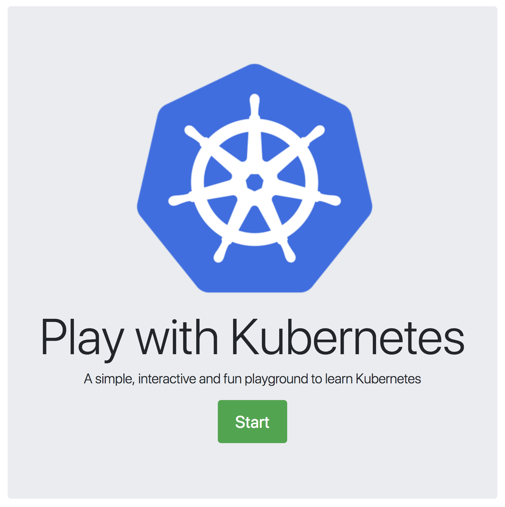
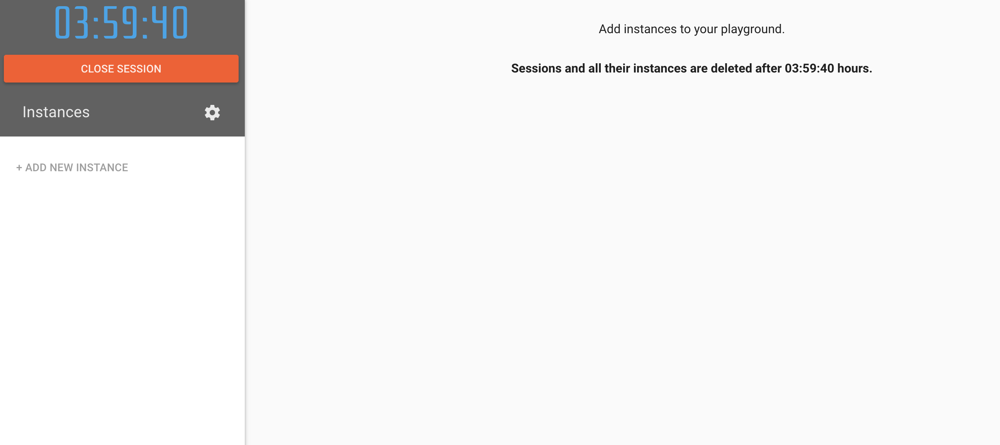
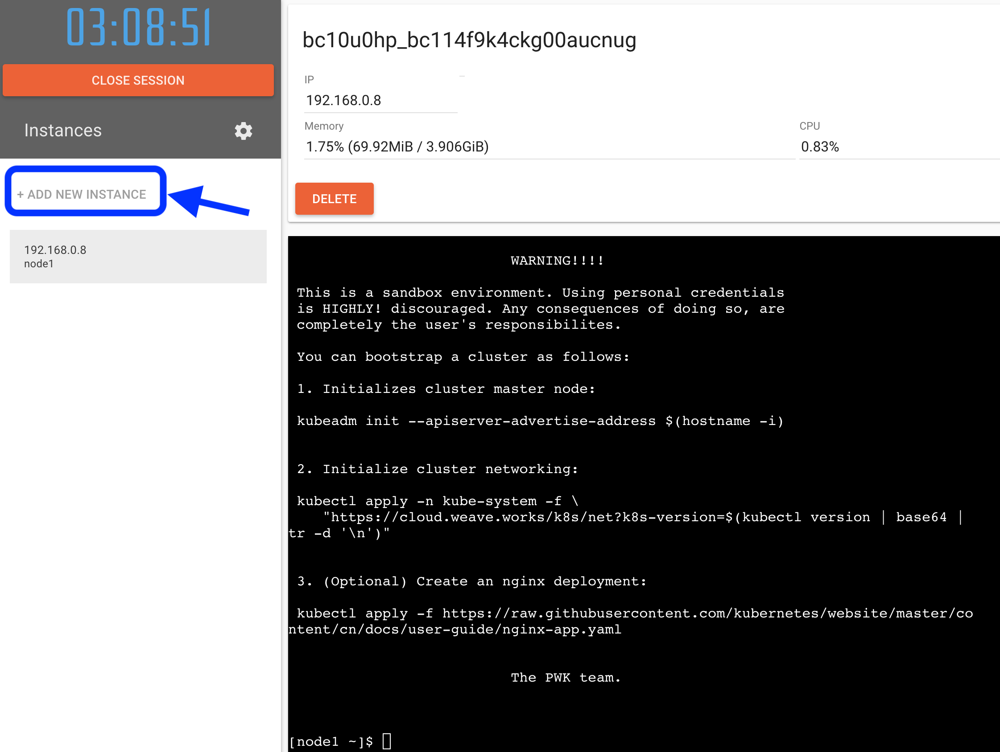
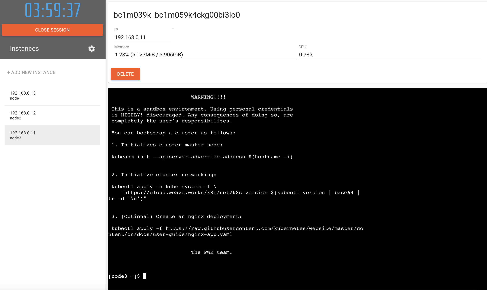

# lab 1 - Startup a Kubernetes Cluster

In this lab we'll use a hosted lab environment called [Play with Kubernetes (PWK)](https://workshop.play-with-k8s.com/) which is version of their [labs.play-with-k8s.com](https://labs.play-with-k8s.com/). If you would like to use a different kubenetes cluster (like your lab cluster or your local Kubernetes on docker or minikube), you can skip this lab.


## Steps

* [1. Set up your PWK environment](#1)
* [2. Install CNI](#2)
* [3. Adding more nodes to the cluster](#3)

## <a name="1"></a> 1 - Set up your PWK environment


To start using PWK you will either need a github id or docker id


If you need a docker id, please visit [Docker Cloud](https://cloud.docker.com/) and proceed with the signup. 

After successful login, with either docker or github credentials, you will be at the start screen.


Once you start the session, you will have your own lab environment.


You can now start adding instances by using the `ADD NEW INSTANCE` button on the left.

When you created your first instance it will have the name `node1`. The instances come with [Docker] (https://www.docker.com/) and [kubeadm] (https://kubernetes.io/docs/setup/independent/create-cluster-kubeadm/) preinstalled. 

Also, instructions for bootstrapping a kubernetes cluster with `kubeadm` will be presented. We will be following these instructions to setup the cluster next.


*Warning:* Please donot follow the instructions as it is. We will be following similar but slightly different instructions described below.

Let us use `node1` as the master node for our cluster. Please note: setting up a multi-master cluster is out of the scope of this workshop, but we will be creating a multi-node cluster in this lab.

Before we start bootstrapping the cluster let us first update DNS settings on the node. This step is needed to get external network connectivity from within the kuberentes cluster we are about to setup. You are free to use any public DNS but for the purpose of this workshop we will use Google's public DNS.

```sh
echo "nameserver 8.8.8.8" >> /etc/resolv.conf
```

Next, let us bootstrap the kubernetes cluster by initializing cluster master (`node1`) node:
```sh
kubeadm init --apiserver-advertise-address $(hostname -i)
```


Sample output from initialization:
```sh
Your Kubernetes master has initialized successfully!

To start using your cluster, you need to run (as a regular user):

  mkdir -p $HOME/.kube
  sudo cp -i /etc/kubernetes/admin.conf $HOME/.kube/config
  sudo chown $(id -u):$(id -g) $HOME/.kube/config

You should now deploy a pod network to the cluster.
Run "kubectl apply -f [podnetwork].yaml" with one of the options listed at:
  http://kubernetes.io/docs/admin/addons/

You can now join any number of machines by running the following on each node
as root:

  kubeadm join --token 0c6e9e.607906dbdcacbf64 192.168.0.8:6443 --discovery-token-ca-cert-hash sha256:b8116ec1b224d82983b10353498d222f6f2e8fcbdf5d1075b4eece0f37df5896

Waiting for api server to startup.........
Warning: kubectl apply should be used on resource created by either kubectl create --save-config or kubectl apply
daemonset "kube-proxy" configured
No resources found
```

As part of the initialization `kubeadm` has written config files needed, deployed Kubernetes control plane components (like `kube-apiserver`, `kube-dns`, `kube-proxy`, `etcd`, etc.) as `docker` containers, sets up necessary RBAC, and also, set up `kubectl` for the `root` user.

Please make a note of (copy and save) the `kubeadm join` command from the previous output for later use. The command should look like the one below (do not use this example):
```sh
kubeadm join --token 0c6e9e.607906dbdcacbf64 192.168.0.8:6443 --discovery-token-ca-cert-hash sha256:b8116ec1b224d82983b10353498d222f6f2e8fcbdf5d1075b4eece0f37df5896
```

Let us first check the status of the nodes and then the pods.
To check the status of the nodes:
```sh
kubectl get nodes
```

Output of the previous command:
```sh
[node1 ~]$ kubectl get nodes
NAME      STATUS     ROLES     AGE       VERSION
node1     NotReady   master    1h        v1.10.2
```

To check the status of the pods:
```sh
kubectl get pods --all-namespaces
```

Output from the previous command:
```sh
[node1 ~]$ kubectl get pods --all-namespaces
NAMESPACE     NAME                            READY     STATUS    RESTARTS   AGE
kube-system   etcd-node1                      1/1       Running   0          1h
kube-system   kube-apiserver-node1            1/1       Running   0          59m
kube-system   kube-controller-manager-node1   1/1       Running   0          1h
kube-system   kube-dns-545bc4bfd4-nnbwn       0/3       Pending   0          1h
kube-system   kube-proxy-pxq27                1/1       Running   0          1h
kube-system   kube-scheduler-node1            1/1       Running   0          1h
```

We can see that the master node is `NotReady` state. We need to install a pod network add-on so that our pods can communicate with each other.

Also, `kube-dns` will not start up before a network is installed. The general recommendation is to install Container Network Interface (CNI) based network. For this workshop we will go with [Weave Net](https://www.weave.works/oss/net/) from [WeaveWorks](https://www.weave.works/).


## <a name="2"></a> 2 - Install CNI

To install weave net:
```sh
kubectl apply -n kube-system -f "https://cloud.weave.works/k8s/net?k8s-version=$(kubectl version | base64 |tr -d '\n')"
```

Output from previous command:
```sh
[node1 ~]$ kubectl apply -n kube-system -f \
>     "https://cloud.weave.works/k8s/net?k8s-version=$(kubectl version | base64 |tr -d '\n')"
serviceaccount "weave-net" created
clusterrole "weave-net" created
clusterrolebinding "weave-net" created
role "weave-net" created
rolebinding "weave-net" created
daemonset "weave-net" created
```

If we re-check the status of the nodes, we will see it is now in `Ready` state.
```sh
[node1 ~]$ kubectl get nodes
NAME      STATUS    ROLES     AGE       VERSION
node1     Ready     master    1h        v1.10.2
```

Let us check the status of the pods next:
```sh
[node1 ~]$ kubectl get pods --all-namespaces
NAMESPACE     NAME                            READY     STATUS    RESTARTS   AGE
kube-system   etcd-node1                      1/1       Running   0          1h
kube-system   kube-apiserver-node1            1/1       Running   0          1h
kube-system   kube-controller-manager-node1   1/1       Running   0          1h
kube-system   kube-dns-545bc4bfd4-nnbwn       3/3       Running   0          1h
kube-system   kube-proxy-pxq27                1/1       Running   0          1h
kube-system   kube-scheduler-node1            1/1       Running   0          1h
kube-system   weave-net-wq5t5                 2/2       Running   0          2m
```

We can see all the pods are in `Running` state.

## <a name="3"></a> 3 - Adding more nodes to the cluster

Now let us add more nodes to our cluster. You are free to add as many instances as you want by clicking the `ADD NEW INSTANCE` button on the left. For the purpose of this workshop let us add 2 more instances.



On each of the instances let us first update the DNS settings, as before:
```sh
echo "nameserver 8.8.8.8" >> /etc/resolv.conf
```

Now we can make the new nodes join the kubernetes cluster by using `kubeadm join` we have made a note from earlier by running that command on each of the nodes:
```sh
kubeadm join --token 0c6e9e.607906dbdcacbf64 192.168.0.8:6443 --discovery-token-ca-cert-hash sha256:b8116ec1b224d82983b10353498d222f6f2e8fcbdf5d1075b4eece0f37df5896
```

Output from previous command:
```sh
[node2 ~]$ kubeadm join --token 0c6e9e.607906dbdcacbf64 192.168.0.8:6443 --discovery-token-ca-cert-hash sha256:b8116ec1b224d82983b10353498d222f6f2e8fcbdf5d1075b4eece0f37df5896
Initializing machine ID from random generator.
[kubeadm] WARNING: kubeadm is in beta, please do not use it for production clusters.
[preflight] Skipping pre-flight checks
[discovery] Trying to connect to API Server "192.168.0.8:6443"
[discovery] Created cluster-info discovery client, requesting info from "https://192.168.0.8:6443"
[discovery] Requesting info from "https://192.168.0.8:6443" again to validate TLS against the pinned public key
[discovery] Cluster info signature and contents are valid and TLS certificate validates against pinned roots, will use API Server "192.168.0.8:6443"
[discovery] Successfully established connection with API Server "192.168.0.8:6443"
[bootstrap] Detected server version: v1.8.13
[bootstrap] The server supports the Certificates API (certificates.k8s.io/v1beta1)

Node join complete:
* Certificate signing request sent to master and response
  received.
* Kubelet informed of new secure connection details.

Run 'kubectl get nodes' on the master to see this machine join.
```

We can go back to the master node `node1` terminal and check the status of the nodes:
```sh
watch kubectl get nodes
```

Initially the new nodes will be in `Not Ready` state and will eventually become `Ready`

Output from previous command:
```sh
Every 2.0s: kubectl get nodes                                                                Mon May 21 03:27:34 2018

NAME      STATUS    ROLES     AGE       VERSION
node1     Ready     master    2h        v1.10.2
node2     Ready     <none>    22m       v1.10.2
node3     Ready     <none>    55s       v1.10.2
```

We now have a 3 node kubernetes cluster setup and ready for us to deploy [Istio](http://istio.io/).


#### [Continue to lab 2 - Deploy Istio](../lab-2/README.md)
