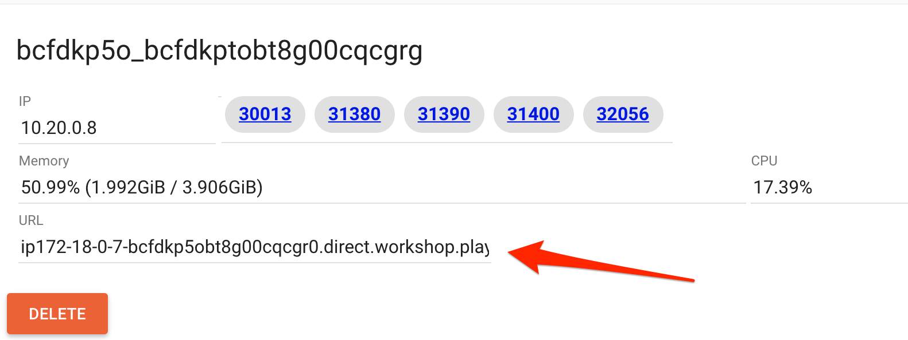

# Lab 2 - Deploy Istio

Now that we have the kubernetes cluster, we are ready to deploy Istio.

## Steps

* [1. Installing Istio](#1)
* [2. Seting up istioctl](#2)
* [3. Verify install](#3)
* [4. Installing Add-ons](#4)

## <a name="1"></a> 1 - Installing Istio
As part of this lab we will install Istio 0.8.0 on your kubernetes cluster.

We have developed an Istio [Mixer Adapter](https://github.com/solarwinds/istio-adapter) which can ship metrics to [Appoptics](https://www.appoptics.com/) and logs to [Loggly](https://www.loggly.com/) and [Papertrail](https://papertrailapp.com). If you would like to leverage this adapter, please proceed to [Optional Lab 2](optional.md) to set things up, get the API tokens and then continue this lab.

```sh
curl https://raw.githubusercontent.com/leecalcote/istio-service-mesh-workshop/master/deployment_files/istio-0.8.0/istio-solarwinds-0.8.0.yaml | sed "s/<appoptics token>/$AOTOKEN/g" | sed "s/<loggly token>/$LOGGLY_TOKEN/g" > istio.yaml

kubectl apply -f istio.yaml
```

## <a name="2"></a> 2 - Verify install

Istio is deployed in a separate Kubernetes namespace `istio-system`. To check if Istio is deployed and also to see all the pieces that are deployed, we can do the following:

```sh
watch kubectl get all -n istio-system
```


## <a name="3"></a> 3 - Setting up istioctl
On a *nix system, you can setup istioctl by doing the following: 

```sh
curl -L https://git.io/getLatestIstio | sh -
```
The above command will get the latest Istio package, which at the time of this writing is 0.8.0.

```sh
export PATH="$PATH:/root/istio-0.8.0/bin"
```

To verify `istioctl` is setup lets try to print out the command help
```sh
istioctl version
```


## Install Add-ons

`Istio` comes with several addons like:
  1. [Prometheus](https://prometheus.io/)
  2. [Grafana](https://grafana.com/)
  3. [Zipkin](https://zipkin.io/)
  4. [Jaeger](https://www.jaegertracing.io/)
  5. [Service Graph](https://istio.io/docs/tasks/telemetry/servicegraph/)


For the folks who did NOT want to use Appoptics, you choose to use prometheus and grafana for viewing the metrics from `Istio`. 

For distributed tracing, you can choose between [Zipkin](https://zipkin.io/) or [Jaeger](https://www.jaegertracing.io/).

Service graph is another add-on which can be used to generate a graph of services within an Istio mesh. Service graph too is deployed as part of Istio in this lab.

Istio, deployed as part of this workshop, comes deployed with Prometheus, Grafana, Jaeger and Service Graph.

### Exposing services

By default addon services are deployed as ClusterIP type services, except Jaeger. We can access the services outside by either changing the type to NodePort or LoadBalancer (if you have a loadbalancer setup) or by port forwarding. I will briefly show using NodePort and port forwarding here.

#### Exposing with NodePort
To expose them using NodePort service type, we can edit the services and change the service type from `ClusterIP` to `NodePort`

```sh
kubectl -n istio-system edit svc prometheus
```

```sh
kubectl -n istio-system edit svc grafana
```

```sh
kubectl -n istio-system edit svc servicegraph
```

Once this is done the services will be assigned dedicated ports on the hosts. 

To find the assigned ports for grafana:
```sh
kubectl -n istio-system get svc grafana
```

To find the assigned ports for prometheus:
```sh
kubectl -n istio-system get svc prometheus
```

To find the assigned ports for servicegraph:
```sh
kubectl -n istio-system get svc servicegraph
```

To find the assigned ports for jaeger, which was already exposed as a LoadBalancer service:
```sh
kubectl -n istio-system get svc tracing
```


#### Exposing with port-forward
To port-forward grafana:
```sh
kubectl -n istio-system port-forward $(kubectl -n istio-system get pod -l app=grafana \
  -o jsonpath='{.items[0].metadata.name}') 3000:3000 &
```

To port-forward prometheus:
```sh
kubectl -n istio-system port-forward \
  $(kubectl -n istio-system get pod -l app=prometheus -o jsonpath='{.items[0].metadata.name}') \
  9090:9090 &
```

To port-forward service graph:
```sh
kubectl -n istio-system port-forward \
  $(kubectl -n istio-system get pod -l app=servicegraph -o jsonpath='{.items[0].metadata.name}') \
  8088:8088 &
```

### Accessing exposed services

In `PWK`, once a port is exposed it will appear on top of the page as shown below as clickable hyperlinks:


We can click on the new relevant links now and navigate to the addons web UI, if available. 


If, for some reason, the links for the ports **DONOT** show up, you can grab the URL as shown in the image below, append the port and access the service.




Port forward runs in the foreground. We have appeneded '&' to the end of the above 2 commands to run them in the background. If you donot want this behavior, please remove the '&'.


#### [Continue to lab 3 - Deploy Sample Bookinfo app](../lab-3/README.md)