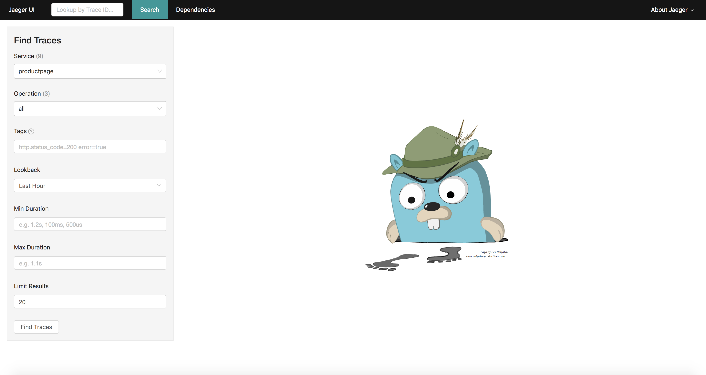

# lab 2 - Deploy Istio

Now that we have the kubernetes cluster, we are ready to deploy Istio.

## Steps

* [1. Installing Istio](#1)
* [2. Seting up istioctl](#2)
* [3. Verify install](#3)
* [4. Installing Add-ons](#4)

## <a name="1"></a> 1 - Installing Istio
At the time of writing, Istio 0.8.0 was just released. Istio 0.7.1 has been around for sometime now. You can pick one of these to install on your kubernetes cluster.

We have developed an Istio [Mixer Adapter](https://github.com/solarwinds/istio-adapter) which can ship metrics to [Appoptics](https://www.appoptics.com/) and logs to [Loggly](https://www.loggly.com/) and [Papertrail](https://papertrailapp.com). If you would like to leverage this adapter, please proceed to [Optional Lab 2](optional.md) to set things up, get the API tokens and [Installing Istio](#aolg) (OR) please proceed to [Installing Istio](#noaolg).

### <a name="noaolg"></a>Installing istio **WITHOUT** Appoptics and Loggly Tokens

For Istio 0.7.1:
```sh
kubectl apply -f https://raw.githubusercontent.com/leecalcote/istio-service-mesh-workshop/master/deployment_files/istio-0.7.1/istio-0.7.1.yaml
```

For Istio 0.8.0:
```sh
kubectl apply -f https://raw.githubusercontent.com/leecalcote/istio-service-mesh-workshop/master/deployment_files/istio-0.8.0/istio-0.8.0.yaml
```


### <a name="aolg"></a>Installing istio with Appoptics and Loggy Tokens

We will proceed with deploying Istio under the presumption that you have obtained Appoptics and Loggly API tokens and have stored them as environment variables `AOTOKEN` and `LOGGLY_TOKEN` respectively. If you would like to use one and not the other, please set an empty value to the respective environemt variable.

For Istio 0.7.1:
```sh
curl https://raw.githubusercontent.com/leecalcote/istio-service-mesh-workshop/master/deployment_files/istio-0.8.0/istio-solarwinds-0.8.0.yaml | sed "s/<appoptics token>/$AOTOKEN/g" | sed "s/<loggly token>/$LOGGLY_TOKEN/g" > istio.yaml

kubectl apply -f istio.yaml
```

For Istio 0.8.0:
```sh
curl https://raw.githubusercontent.com/leecalcote/istio-service-mesh-workshop/master/deployment_files/istio-0.8.0/istio-solarwinds-0.8.0.yaml | sed "s/<appoptics token>/$AOTOKEN/g" | sed "s/<loggly token>/$LOGGLY_TOKEN/g" > istio.yaml

kubectl apply -f istio.yaml
```

## <a name="2"></a> 2 - Verify install

Istio is deployed in a separate Kubernetes namespace `istio-system`. To check if Istio is deployed and also to see all the pieces that are deployed, we can do the following:

```sh
watch kubectl get all -n istio-system
```


## <a name="3"></a> 3 - Setting up istioctl
On a *nix system, you can setup istioctl by doing the following: 

```sh
curl -L https://git.io/getLatestIstio | sh -
```
The above command will get the latest Istio package, which at the time of this writing is 0.8.0.

To get Istio 0.7.1 package, please follow these instructions:

```sh
yum install -y wget
wget https://github.com/istio/istio/releases/download/0.7.1/istio-0.7.1-linux.tar.gz
tar -xzvf istio-0.7.1-linux.tar.gz
```

Assuming you are in the `/root` directory, adding istio executables to the PATH can be done by doing the following:

For Istio 0.7.1:
```sh
export PATH="$PATH:/root/istio-0.7.1/bin"
```

For Istio 0.8.0:
```sh
export PATH="$PATH:/root/istio-0.8.0/bin"
```

To verify `istioctl` is setup lets try to print out the command help
```sh
istioctl -h
```


## Install Add-ons
For the folks who did NOT want to use Appoptics, you can deploy prometheus and grafana for viewing the metrics from `Istio`.

For distributed tracing, you can choose between [Zipkin](https://zipkin.io/) or [Jaeger](https://www.jaegertracing.io/).

On Istio 0.8.0, Jaeger is deployed as part of `istio-0.8.0.yaml` or `istio-solarwinds-0.8.0.yaml`.

Service graph is another add-on which can be used to generate a graph of services within an Istio mesh. On Istio 0.8.0, service graph is deployed as part of `istio-0.8.0.yaml` or `istio-solarwinds-0.8.0.yaml`.

### Grafana, Prometheus
On Istio 0.7.1, you can deploy prometheus by running the following command:

```sh
kubectl apply -f https://raw.githubusercontent.com/leecalcote/istio-service-mesh-workshop/master/deployment_files/istio-0.7.1/prometheus.yaml
```

On Istio 0.8.0, prometheus is deployed as part of `istio-0.8.0.yaml` or `istio-solarwinds-0.8.0.yaml`.


To deploy grafana:
```sh
kubectl apply -f https://raw.githubusercontent.com/leecalcote/istio-service-mesh-workshop/master/deployment_files/istio-0.7.1/grafana.yaml
```

By default prometheus and grafana are deployed as ClusterIP type services. We can access the services outside by either changing the type to LoadBalancer or NodePort or by port forwarding or configure Istio Ingress. I will briefly show using NodePort and port forwarding here.

#### Exposing with NodePort
To expose them using NodePort service type, we can edit the services and change the service type from `ClusterIP` to `NodePort`

```sh
kubectl -n istio-system edit svc prometheus
```

```sh
kubectl -n istio-system edit svc grafana
```

Once this is done the services will be assigned dedicated ports on the hosts. 

To find the assigned ports for grafana:
```sh
kubectl -n istio-system get svc grafana
```

To find the assigned ports for prometheus:
```sh
kubectl -n istio-system get svc prometheus
```

In `PWK`, once a port is exposed it will appear on top of the page as shown below as clickable hyperlinks:


We can click on the new relevant links now and navigate to prometheus dashboard and grafana dashboards. In grafana there is a dedicated dashboard created for Istio called `Istio Dashboard`.


#### Exposing with port-forward
To port-forward grafana:
```sh
kubectl -n istio-system port-forward $(kubectl -n istio-system get pod -l app=grafana \
  -o jsonpath='{.items[0].metadata.name}') 3000:3000 &
```

To port-forward prometheus:
```sh
kubectl -n istio-system port-forward \
  $(kubectl -n istio-system get pod -l app=prometheus -o jsonpath='{.items[0].metadata.name}') \
  9090:9090 &
```

Port forward runs in the foreground. We have appeneded '&' to the end of the above 2 commands to run them in the background. If you donot want this behavior, please remove the '&'.

### <a name="zipkin"></a>Zipkin
On Istio 0.7.1, we can deploy Zipkin by:

```sh
kubectl apply -f https://raw.githubusercontent.com/leecalcote/istio-service-mesh-workshop/master/deployment_files/istio-0.7.1/zipkin.yaml
```

You can follow similar steps as described above to expose this service as well.

Command to port-forward:
```sh
kubectl port-forward -n istio-system \
  $(kubectl get pod -n istio-system -l app=zipkin -o jsonpath='{.items[0].metadata.name}') \
  9411:9411 &
```

### <a name="jaeger"></a> Jaeger
On Istio 0.7.1, we can deploy Jaeger by:

```sh
kubectl apply -n istio-system -f https://raw.githubusercontent.com/jaegertracing/jaeger-kubernetes/master/all-in-one/jaeger-all-in-one-template.yml
```

You can follow similar steps as described above to expose this service as well.

One Istio 0.8.0, Jaeger port is already exposed for you as part of `istio-0.8.0.yaml` or `istio-solarwinds-0.8.0.yaml`.




Command to port-forward:
```sh
kubectl port-forward -n istio-system $(kubectl get pod -n istio-system -l app=jaeger -o jsonpath='{.items[0].metadata.name}') 16686:16686 &
```


### Service Graph
On Istio 0.7.1, we can deploy service graph by:

```sh
kubectl apply -f https://raw.githubusercontent.com/leecalcote/istio-service-mesh-workshop/master/deployment_files/istio-0.7.1/servicegraph.yaml
```

You can follow similar steps as described above to expose this service as well.

Command to port-forward:
```sh
kubectl -n istio-system port-forward \
  $(kubectl -n istio-system get pod -l app=servicegraph -o jsonpath='{.items[0].metadata.name}') \
  8088:8088 &
```


#### [Continue to lab 3 - Deploy Sample Bookinfo app](../lab-3/README.md)