# lab 2 - Setting up API Tokens (optional)

As part of this workshop we will be sending access logs from Istio to [Loggly](https://www.loggly.com/) and telemetry data to [Appoptics](https://www.appoptics.com/). In this lab we will take you through the steps needed to setup Loggly & Appoptics API tokens and configure Appoptics dashboard.

## Steps

* [1. Set up loggly API Token](#1)
* [2. Setup Appoptics API Token](#2)
* [3. Setup Appoptics Dashboard](#3)

##  1 - Set up loggly API Token

Getting a Loggly API token for use with istio:

[Loggly](https://www.loggly.com/)
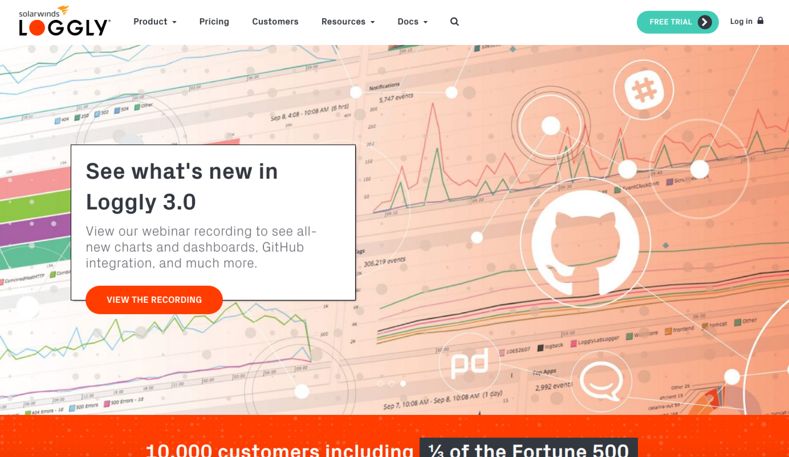

To signup for [Loggly signup](https://www.loggly.com/signup/)
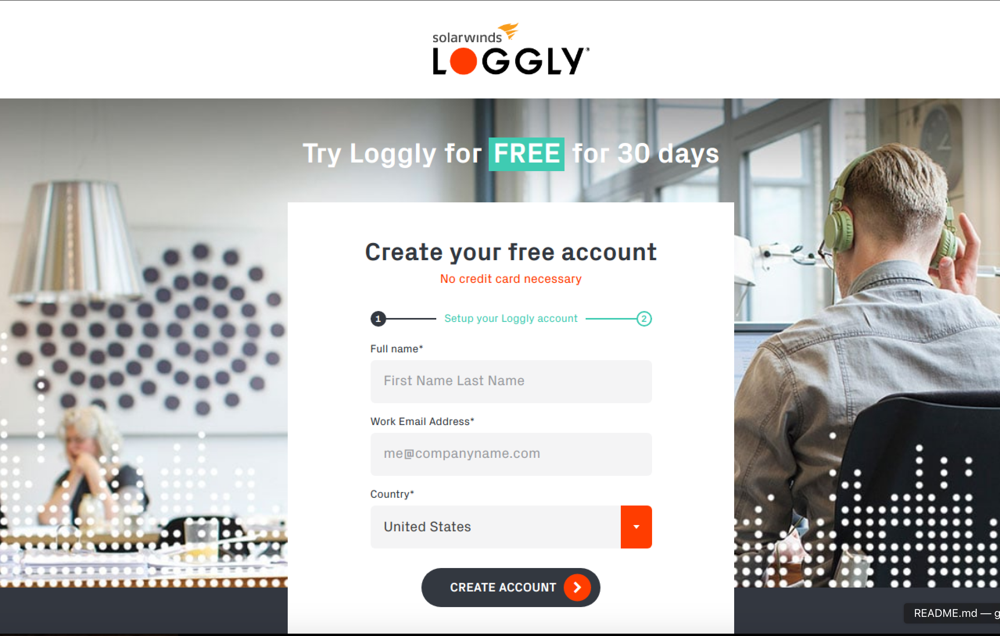

[Loggin sign in](https://www.loggly.com/login/)
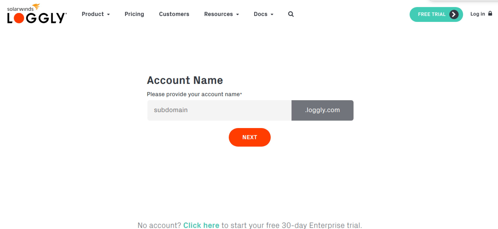

Loggly landing page: 

Select `Account` from the user menu
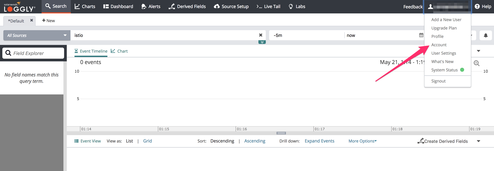

From the `Account` overview page select `API Tokens`
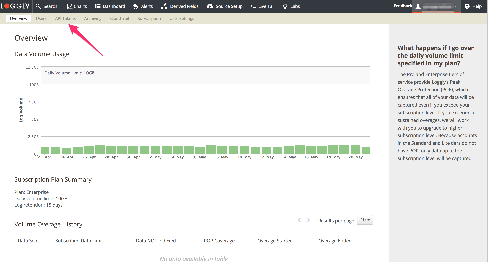

From the `API Tokens` page let us create a new API Token by using the `Add New` button
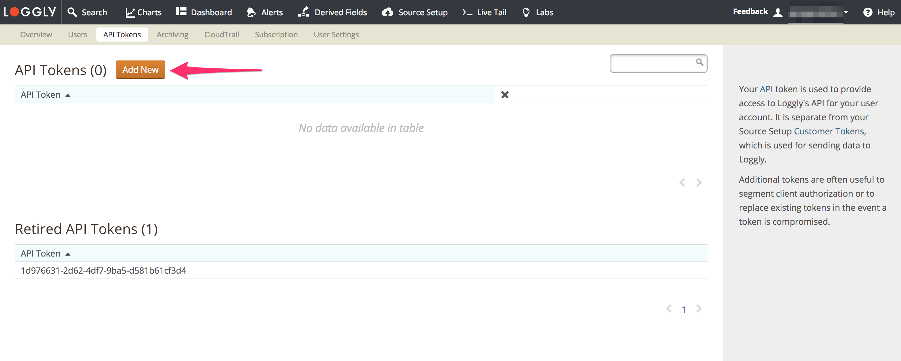

This open a popup confirming the creation of a new token. Use the `Create` button to create a new API Token.
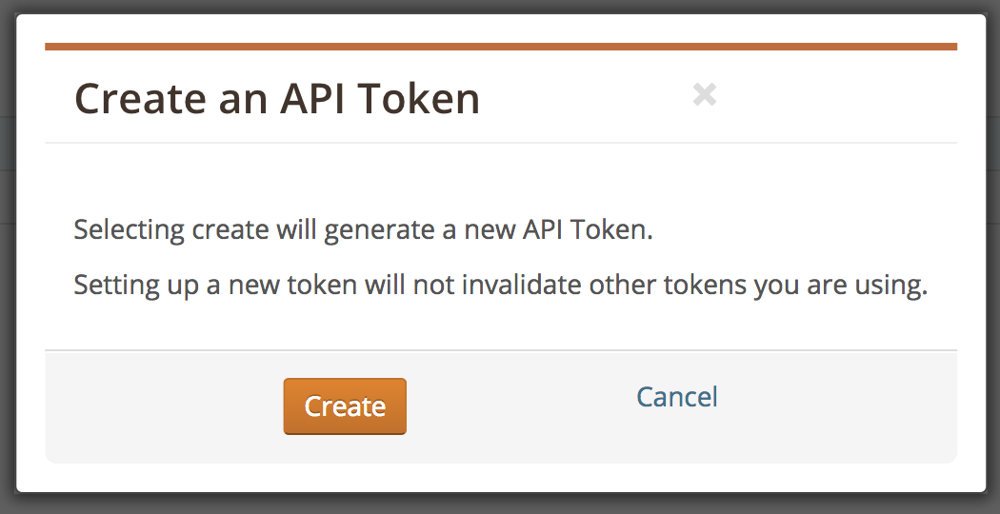

Once the token is created you will be able to see it in the API Tokens table. On the left there is a `copy to clipboard` button which can help with copying the new token.
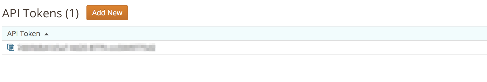

Paste the newly created token into the istio-solarwinds-0.7.1.yaml for Istio 0.7.1 or into istio-solarwinds-0.8.0.yaml for Istio 0.8.0 file in the \<loggly token> placeholder.

##  2 - Setup Appoptics API Token
Getting an Appoptics API token for use with istio:
[Appoptics](https://www.appoptics.com/)
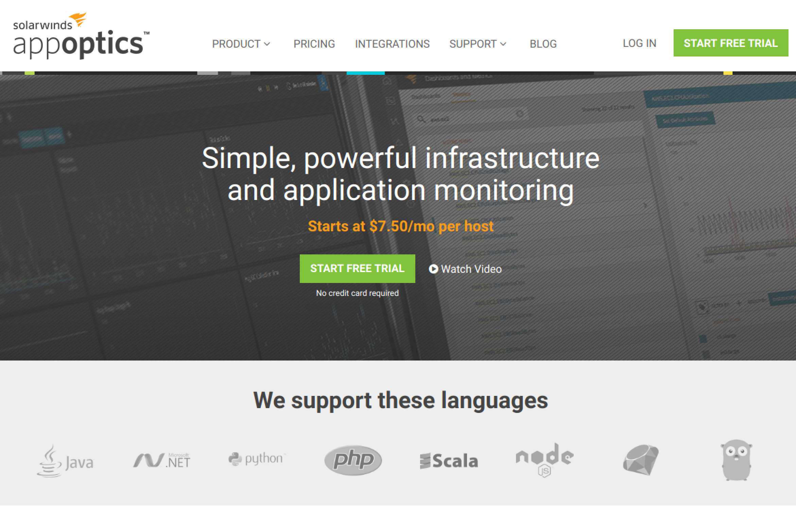

[appoptics signup](https://my.appoptics.com/sign_up)

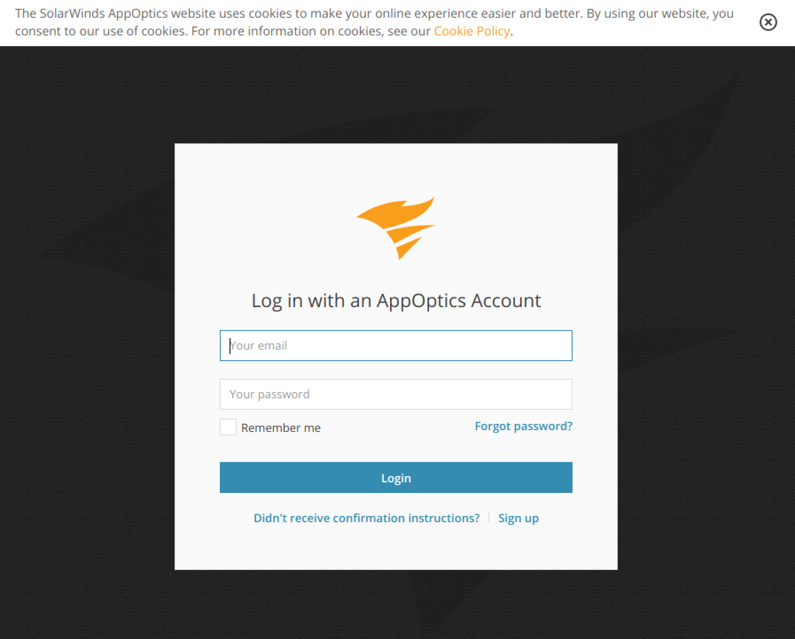

After you have logged in you can navigate to create an API token by clicking on the `API Tokens` link at the top.

We can now generate API tokens by hitting the `Generate New API Token` button

A popup for creating a token will open where you can select the access level needed (for this workshop we need `Record only` access) and a meaningful name for your token. When you hit `Generate` a token will be created 
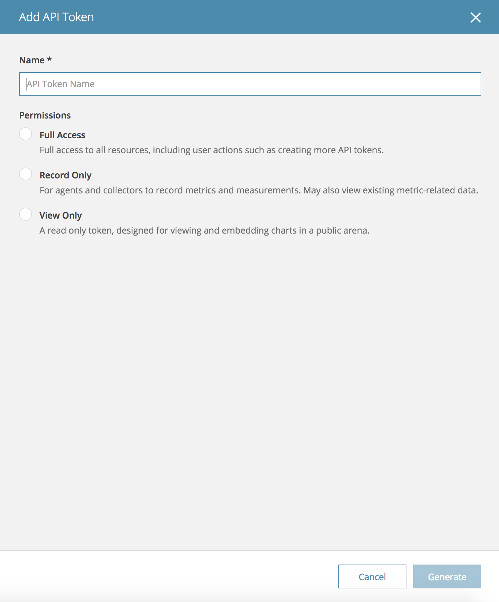

The created token will be shown in the popup. We can now copy the token to clipboard from here.

The created token can also be seen in the table.

You can now paste the copied token into istio-solarwinds-0.7.1.yaml for Istio 0.7.1 or into istio-solarwinds-0.8.0.yaml for Istio 0.8.0 file \<appoptics token> placeholder.

##  3 - Setup Appoptics Dashboard

Now from the left menu select `Dashboard & Metrics`.

It will take you to a Dashboards page
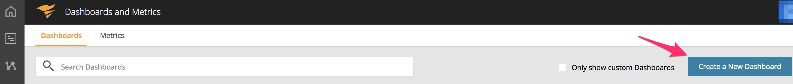

Once you are in the `Dashboards` screen you can create a new dashboard by using `Create a New Dashboard` button. It will take you right to a new dashboard.
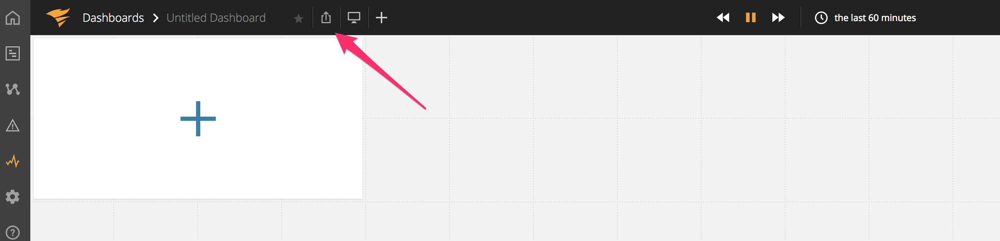

You can now give your dashboard a suitable name. Next click on the button shown in the previous image. It will open up a menu with an option to import a dashboard.

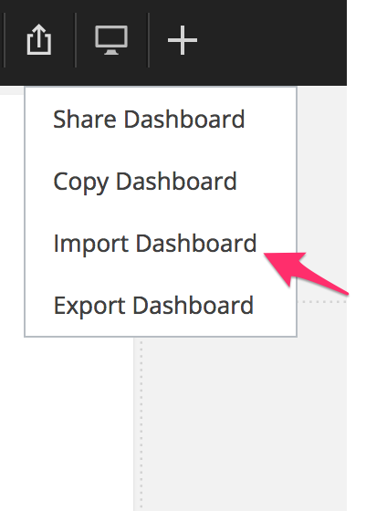

Clicking the `Import Dashboard` menu item will open a popup where we can enter the contents of appoptics_dashboard.yaml file

After pasting the contents, we can validate it by using the `Validate` button

Once validated, we can import the dashboard by using the `Import` button. You will be presented with a warning popup as shown here. Proceed by clicking `OK` here.

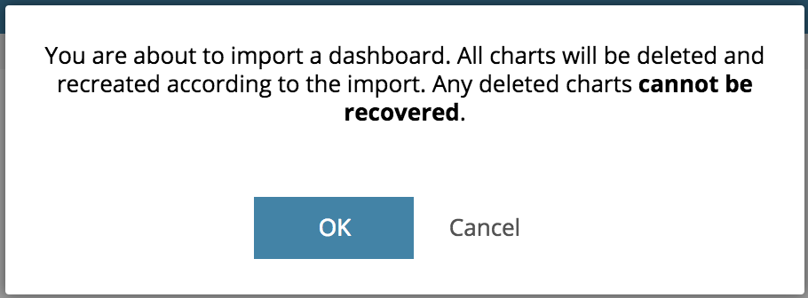

You will be taken to a pre-constructed dashboard.
