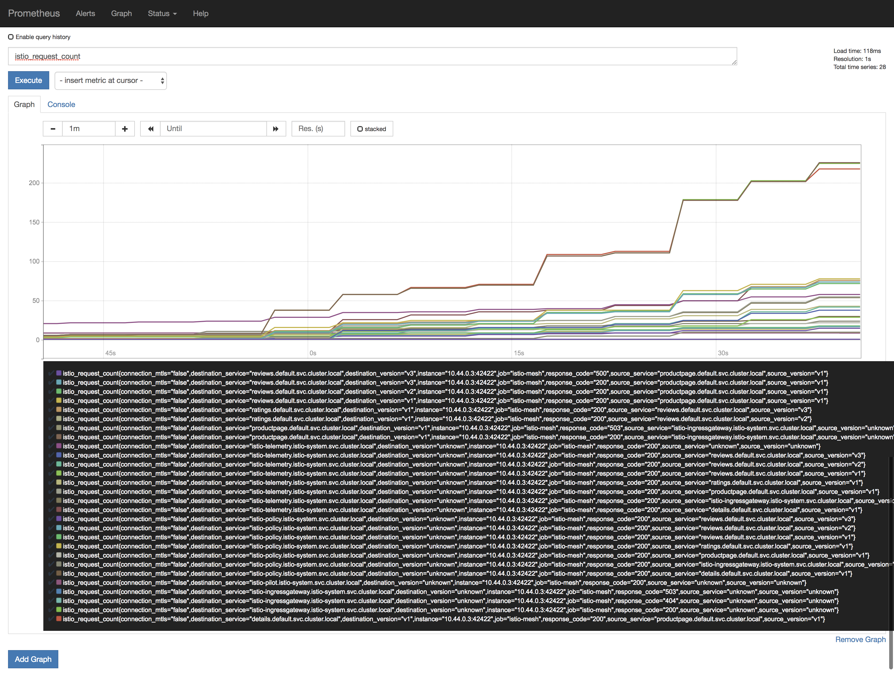

# Lab 4 - Telemetry

## 4.1 Generate Load on Bookinfo
Let's generate HTTP traffic against the BookInfo application, so we can see interesting telemetry. Grab the ingress gateway port number and store it in a variable:

```sh
kubectl get service istio-ingressgateway -n istio-system --template='{{(index .spec.ports 1).nodePort}}'
```

Once we have the port, we can append the IP of one of the nodes to get the host. 

The URL to run a load test against will be `http://<IP/hostname of any of the nodes in the cluster>:<ingress port>/productpage`

__Please note:__ If you are using Docker Desktop, please use the IP address of your host. You can leave the port blank. For example: `http://1.2.3.4/productpage`

You can now use the computed URL above in Meshery, in the browser, to run a load test and see the results.

In Meshery navigate to the Performance page from the left nav menu.

On the Performance page, please do the following:
1. give this load test a memorable name
1. enter the URL to the Book info productpage you derived above
1. select `Istio` in the `Service Mesh` dropdown
1. enter a valid number for `Concurrent requests`
1. enter a valid number for `Queries per second`
1. enter a valid `Duration` (a number followed by `s` for seconds (OR) `m` for minutes (OR) `h` for hour)

Once you have entered values for all the fields, you now click on `Run Test`.

This will run the load test and show the results in a chart ([see screenshot](https://raw.githubusercontent.com/leecalcote/istio-service-mesh-workshop/feature/blend-in-meshery/lab-4/img/meshery_initial_load_test.png)).


Now that we have run the load test, lets view the generated metrics in the cluster.

### Exposing services
Istio add-on services are deployed by default as `ClusterIP` type services. We can expose the services outside the cluster by either changing the Kubernetes service type to `NodePort` or `LoadBalancer` or by port-forwarding or by configuring Kubernetes Ingress. 

**Option 1: Expose services with NodePort**
To expose them using NodePort service type, we can edit the services and change the service type from `ClusterIP` to `NodePort`

**Option 2: Expose services with port-forwarding**
Port-forwarding runs in the foreground. We have appeneded `&` to the end of the above 2 commands to run them in the background. If you donot want this behavior, please remove the `&` from the end.

## 4.2 Prometheus
You will need to expose the Prometheus service on a port either of the two following methods: 

**Option 1: Expose services with NodePort**

```sh
kubectl -n istio-system edit svc prometheus
```

To find the assigned ports for Prometheus:
```sh
kubectl -n istio-system get svc prometheus
```

**Option 2: Expose Prometheus service with port-forwarding:**
**
Expose Prometheus service with port-forwarding:
```sh
kubectl -n istio-system port-forward \
  $(kubectl -n istio-system get pod -l app=prometheus -o jsonpath='{.items[0].metadata.name}') \
  9090:9090 &
```
Browse to `/graph` and in the `Expression` input box enter: `istio_request_count`. Click the Execute button.




## 4.3 Grafana
You will need to expose the Grafana service on a port either of the two following methods: 
```sh
kubectl -n istio-system edit svc grafana
```
Once this is done the services will be assigned dedicated ports on the hosts. 

To find the assigned ports for Grafana:
```sh
kubectl -n istio-system get svc grafana
```

**Expose Grafana service with port-forwarding:**

```sh
kubectl -n istio-system port-forward $(kubectl -n istio-system get pod -l app=grafana \
  -o jsonpath='{.items[0].metadata.name}') 3000:3000 &
```


<!--
## 4.4 Kiali

**Option 1: Expose services with NodePort**

```sh
kubectl -n istio-system edit svc kiali
```

To find the assigned ports for Servicegraph:
```sh
kubectl -n istio-system get svc kiali
```

**Option 2: Expose Kiali service with port-forwarding:**

```sh
kubectl -n istio-system port-forward \
  $(kubectl -n istio-system get pod -l app=kiali -o jsonpath='{.items[0].metadata.name}') \
  20001:20001 &
```
Update the URI to `/kiali` and you will be presented with a login screen. Please use `admin` for both user name and password. After you login, you can navigate to the different sections using the menu on the left.


## 4.5 - Distributed Tracing
-->

## 4.4 - Distributed Tracing
The sample Bookinfo application is configured to collect trace spans using Zipkin or Jaeger. Although Istio proxies are able to automatically send spans, it needs help from the application to tie together the entire trace. To do this applications need to propagate the appropriate HTTP headers so that when the proxies send span information to Zipkin or Jaeger, the spans can be correlated correctly into a single trace.

To do this the application collects and propagates the following headers from the incoming request to any outgoing requests:

- `x-request-id`
- `x-b3-traceid`
- `x-b3-spanid`
- `x-b3-parentspanid`
- `x-b3-sampled`
- `x-b3-flags`
- `x-ot-span-context`

### Exposing services

Istio add-on services are deployed by default as `ClusterIP` type services. We can expose the services outside the cluster by either changing the Kubernetes service type to `NodePort` or `LoadBalancer` or by port-forwarding or by configuring Kubernetes Ingress. In this lab, we will briefly demonstrate the `NodePort` and port-forwarding ways of exposing services.

#### Option 1: Expose services with NodePort
To expose them using NodePort service type, we can edit the services and change the service type from `ClusterIP` to `NodePort`

For Jaeger, either of `tracing` or `jaeger-query` can be exposed.
```sh
kubectl -n istio-system edit svc tracing
```

Once this is done the services will be assigned dedicated ports on the hosts. 

To find the assigned ports for Jaeger:
```sh
kubectl -n istio-system get svc tracing
```

#### Option 2: Expose services with port-forwarding

To port-forward Jaeger:
```sh
kubectl -n istio-system port-forward \
  $(kubectl -n istio-system get pod -l app=jaeger -o jsonpath='{.items[0].metadata.name}') \
  16686:16686 &
```
<!-- ### 4.5.1 View Traces -->
### 4.4.1 View Traces

Let us find the port Jaeger is exposed on by running the following command:
```sh
kubectl -n istio-system get svc tracing
```

You can click on the link at the top of the page which maps to the right port and it will open Jaeger UI in a new tab. 


## [Continue to Lab 5 - Request Routing and Canary Testing](../lab-5/README.md)
