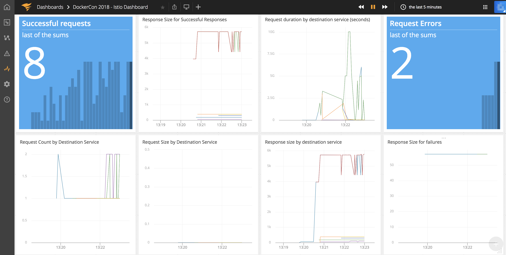
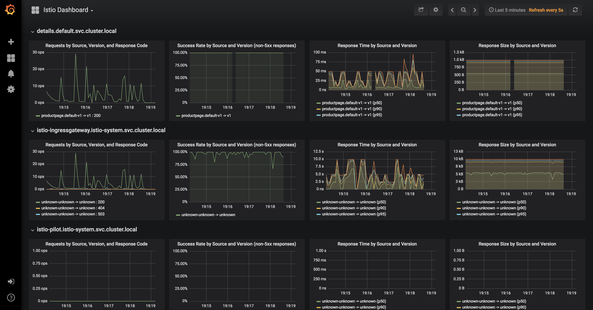
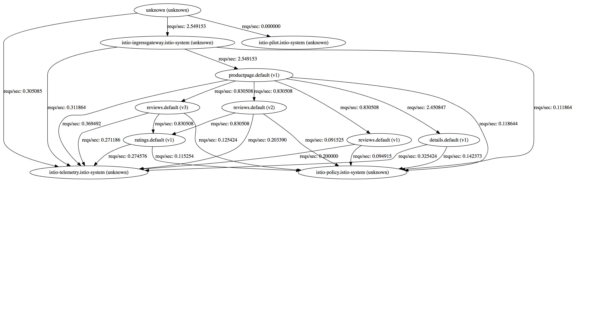

# Lab 5 - Telemetry

## 5.1 Generate Load on Bookinfo
Let's generate HTTP traffic against the BookInfo application, so we can see interesting telemetry. Grab the ingress gateway port number and store it in a variable:

```sh
export INGRESS_PORT=$(kubectl get service istio-ingressgateway -n istio-system --template='{{(index .spec.ports 0).nodePort}}')
```

Once we have the port, we can append the IP of one of the nodes to get the host. In `PWK` we can get the IP from the host list on the left.
```sh
export INGRESS_HOST="<IP>:$INGRESS_PORT"
```

Now, let us generate a small load on the sample app by using [fortio](https://github.com/istio/fortio) which is a load testing library created by the `Istio` team:

The command below will run load test by making 5 calls per second for 5 minutes:
```sh
docker run istio/fortio load -t 5m -qps 5 http://$INGRESS_HOST/productpage
```

Let's now checkout the generated metrics.

## Appoptics
If you had followed [optional lab-2](../lab-2/optional.md), created or have an Appoptics account, created a dashboard, obtained a valid Appoptics API token and deployed Istio with [solarwinds mixer adapter](https://github.com/solarwinds/istio-adapter), you will be able to view the metrics data from Istio in the Appoptics Dashboard.



## Loggly
If you had followed [optional lab-2](../lab-2/optional.md), created or have an Loggly account, obtained a valid Loggly API token and deployed Istio with [solarwinds mixer adapter](https://github.com/solarwinds/istio-adapter), you will be able to view the access logs from Istio in Loggly.


## Grafana

If you have not already exposed grafana, please follow [Lab 2](../lab-2/README.md). 
In `PWK`, once you have exposed grafana on a port by using any of the specified methods, it will appear at the top of the page as a hyperlink. You can click on the link at the top of the page which maps to the right port and it will open grafana in new tab. You can then navigate to the `Istio Dashboard`.



## Prometheus
If you have not already exposed prometheus, please follow [Lab 2](../lab-2/README.md). 
In `PWK`, once you have exposed prometheus on a port by using any of the specified methods, it will appear at the top of the page as a hyperlink. You can click on the link at the top of the page which maps to the right port and it will open prometheus in new tab. 
Browse to `/graph` and in the `Expression` input box enter: `istio_request_count`. Click the Execute button.


## Service Graph

If you have not already exposed servicegraph, please follow [Lab 2](../lab-2/README.md). 
In `PWK`, once you have exposed servicegraph on a port by using any of the specified methods, it will appear at the top of the page as a hyperlink. You can click on the link at the top of the page which maps to the right port and it will open a new tab but will show an error page with `404 not found`. 
Update the URI to `/dotviz` and you will see the generated service graph.


For a more interactive graph, navigate to `force/forcegraph.html`.


## [Continue to lab 6 - Distributed Tracing](../lab-6/README.md)


#### Appendix 5.A Docker for Desktop
***Please note:*** In step 5.1, if you are using Docker for Mac or Windows, INGRESS_HOST should be set to `localhost`.
