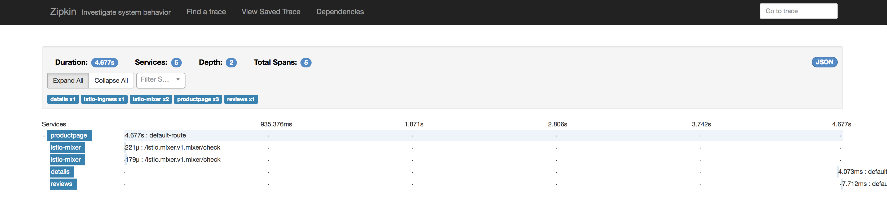

# lab 6 - Distributed Tracing

The sample Bookinfo application is configured to collect trace spans using Zipkin or Jaeger. Although Istio proxies are able to automatically send spans, it needs help from the application to tie together the entire trace. To do this applications need to propagate the appropriate HTTP headers so that when the proxies send span information to Zipkin or Jaeger, the spans can be correlated correctly into a single trace.

To do this the application collects and propagates the following headers from the incoming request to any outgoing requests:

- `x-request-id`
- `x-b3-traceid`
- `x-b3-spanid`
- `x-b3-parentspanid`
- `x-b3-sampled`
- `x-b3-flags`
- `x-ot-span-context`


## View Traces

Now, let us generate a small load on the sample app by using [fortio](https://github.com/istio/fortio) (for more details on this, please refer back to [lab-5](../lab-5/README.md)):

```sh
docker run istio/fortio load -t 5m -qps 5 http://$INGRESS_HOST/productpage
```

### Zipkin
If you have not already deployed and exposed zipkin, please follow [lab-2](../lab-2/README.md). 
In `PWK`, once you have exposed zipkin on a port by using any of the specified methods, it will appear at the top of the page as a hyperlink. You can click on the link at the top of the page which maps to the right port and it will open zipkin web UI.





### Jaeger
If you have deployed Istio 0.8.0 using `istio-0.8.0.yaml` or `istio-appoptics-loggly-0.8.0.yaml`, jaeger service should already be exposed.

On Istio 0.7.1, if you have not already deployed and exposed jaeger, please follow [lab-2](../lab-2/README.md). 

In `PWK`, once jaeger service is exposed on a port by using any of the specified methods, it will appear at the top of the page as a hyperlink. You can click on the link at the top of the page which maps to the right port and it will open Jaeger UI in a new tab. 


#### [Continue to lab 7 - Request Routing and Canary Testing](../lab-7/README.md)
