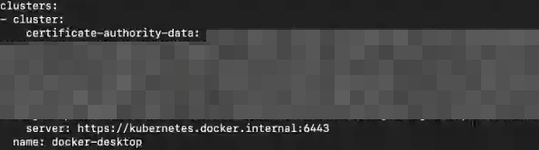

# Prerequisites
You will need each of the following in order to complete the workshop:

1. Docker (installed locally)
1. Kubernetes (installed locally or have remote access to a cluster)
1. Meshery (installed locally)

## Install Docker and Create a Kubernetes Cluster

Access to a Kubernetes cluster is required. You may use any Kubernetes platform of your choice. The "Introduction to Istio" training uses Docker Desktop the example Kubernetes platform. If you would like to use a different Kubernetes cluster (like your lab cluster or Minikube), you can skip lab-1 (this lab).

### Docker Desktop Setup

1. Download and install [Docker Desktop](https://www.docker.com/products/docker-desktop).
1. Ensure 4GB is allocated to your Docker Desktop VM in Docker Desktop preferences ([see screenshot](https://raw.githubusercontent.com/leecalcote/istio-service-mesh-workshop/feature/blend-in-meshery/prereq/img/docker-desktop-memory.png)).
1. Enable Kubernetes in Docker Desktop preferences ([see screenshot](https://raw.githubusercontent.com/leecalcote/istio-service-mesh-workshop/feature/blend-in-meshery/prereq/img/docker-desktop-kube.png)).
1. Please open `~/.kube/config` and check the `docker-desktop` cluster under `clusters` section and ensure you see something like the image below:
  

    __Note__: If you see `https://localhost:6443` as the value for server, please get the IP address of your host and replace `localhost` with the the IP address. The end result should look like this `https://1.2.3.4:6443`.

- Mac and Windows users should be able to continue with Kubernetes on Docker Desktop.
- Linux users should be able to install kubeadm and kubelet with your respective package managers on your machines and continue with the labs. [Here](https://kubernetes.io/docs/setup/independent/create-cluster-kubeadm/) is a link which might be helpful in this regard.

### Minikube setup
Please go [here](https://meshery.layer5.io/docs/installation/minikube) for instructions

#### Check Cluster Status
Check the status of the nodes. Ensure `Ready` state.
```sh
[node1 ~]$ kubectl get nodes
NAME      STATUS    ROLES     AGE       VERSION
node1     Ready     master    1h        v1.15.2
```

Check the status of the pods next:
```sh
[node1 ~]$ kubectl get pods --all-namespaces
NAMESPACE     NAME                            READY     STATUS    RESTARTS   AGE
kube-system   etcd-node1                      1/1       Running   0          1h
kube-system   kube-apiserver-node1            1/1       Running   0          1h
kube-system   kube-controller-manager-node1   1/1       Running   0          1h
kube-system   kube-dns-545bc4bfd4-nnbwn       3/3       Running   0          1h
kube-system   kube-proxy-pxq27                1/1       Running   0          1h
kube-system   kube-scheduler-node1            1/1       Running   0          1h
kube-system   weave-net-wq5t5                 2/2       Running   0          2m
```

We can see all the pods are in `Running` state. If you have a running Kubernetes clsuter, please [continue to Lab 1 - Deploy Istio](../lab-1/README.md) 


## Download and Run Meshery

### Run Meshery Off-Cluster

Using Docker, install Meshery on your local machine by running the following:

```
 sudo curl -L https://git.io/meshery -o /usr/local/bin/meshery
 sudo chmod a+x /usr/local/bin/meshery
 meshery start        
```

Sign into Meshery ([see screenshot](https://raw.githubusercontent.com/leecalcote/istio-service-mesh-workshop/feature/blend-in-meshery/prereq/img/sign-into-meshery.png)) using one of Twitter, Linkedin, GitHub or Google authentication.

Meshery will try to recognize and preload Kubernetes config from under $HOME/.kube folder and preconnect existing service mesh adapters ([see screenshot](https://raw.githubusercontent.com/leecalcote/istio-service-mesh-workshop/feature/blend-in-meshery/prereq/img/meshery_landing_page.png)).


If you want to change the Kubernetes config to use a custom one, you can do so by clicking the gear icon on the right top of the screen ([see screenshot](https://raw.githubusercontent.com/leecalcote/istio-service-mesh-workshop/feature/blend-in-meshery/prereq/img/meshery_landing_page_settings_icon.png)). 

This will take the user to the `Settings` page and here you can load up your new config file and select the context to use ([see screenshot](https://raw.githubusercontent.com/leecalcote/istio-service-mesh-workshop/feature/blend-in-meshery/prereq/img/meshery_settings_page.png)).

In a similar fashion, if you don't see the Istio adapter loaded, you should be able to switch to the `Service Meshes` tab in the `Settings` page and connect to existing adapters from the drop down ([see screenshot](https://raw.githubusercontent.com/leecalcote/istio-service-mesh-workshop/feature/blend-in-meshery/prereq/img/meshery_settings_page-service-meshes.png)).

Once an adapter is connected, you will also see it added to the nav menu on the left ([see screenshot](https://github.com/leecalcote/istio-service-mesh-workshop/raw/feature/blend-in-meshery/prereq/img/meshery_settings_page-service_meshes_with_menu.png)).


For the labs, it will be good to have your terminal and your browser, with Meshery, share your screen so that you don't have to switch between apps frequently.

<!-- ### <span style="color:gray">Alternatively - Run Meshery In-Cluster</span>
 
<p style="color:gray">
Or to install on Kubernetes by cloning the Meshery repo:</p>

 ```
 $ git clone https://github.com/layer5io/meshery.git; cd meshery        
 $ kubectl create ns meshery
 $ kubectl -n meshery apply -f deployment_yamls/k8s
``` -->

# [Continue to Lab 1 - Deploy Istio](../lab-1/README.md)
